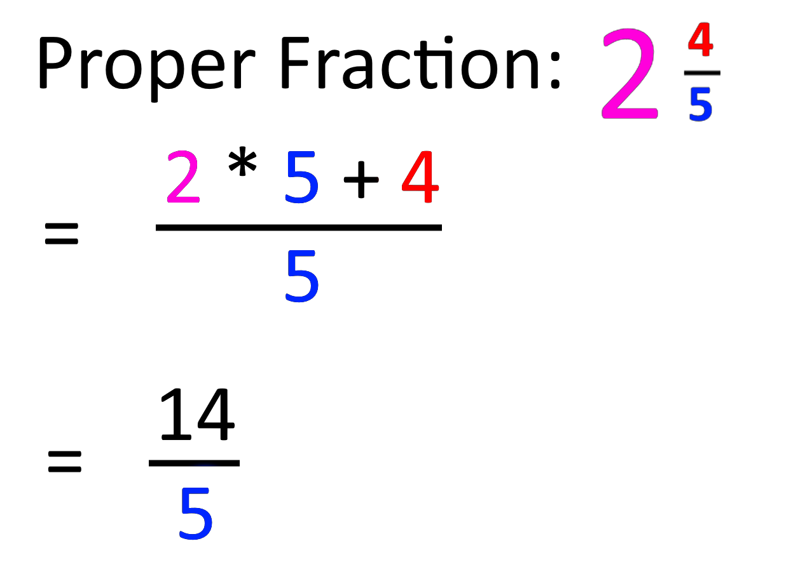

# Lab08Fractions
This lab will focus on constructors, substrings, and arithmetic operators being used on two different objects: `ProperFraction` and `ImproperFraction`


## Step 1: Examination
Start by taking a look at all three files. Although you will not be editing `FractionMain.java`, it will be useful to read through it and understand how it works. Once you have your other files written, `FractionMain.java` will allow you to test your files through your IDE's terminal.

## Step 2: Implementation
The javadoc will have a more detailed explanation for each method. Each method that needs your attention has been marked with a `//TODO Student` comment and can be found in `ProperFraction.java` and `ImproperFraction.java`. Proper fractions are fractions with a whole number as well as a fraction like "1 1/3". Improper fractions will not have a whole number, just a numerator and denominator like "4/3". Some examples of conversions between the two fraction types can be seen in the image below under **Helpful Fraction Examples**.

Start by writing the constructors in both files and working your way down each file one method at a time. A lot of the methods will be very similar between both fraction files.

## Step 3: Testing
Once you have completed the methods, make use of the `FractionMain.java` file. Run your program and test out different fractions. Do your fractions properly simplify? Do your fractions properly convert between fraction types? Do your fractions follow the instructions in the javadoc of what to do if the denominator is 0? Test it out using `FractionMain.java` before you turn it in.

## Step 4: Turning in to Canvas
If you have reached this step, you have completed each method and verified that they function correctly. Congratulations! Zip all the active files into a zip file and submit them to the assinment on canvas

# Additional Information

## Constructor Overloading
Just like how we can overload methods by giving them different parameters, we can also overload objects constructors! We can have a variety of different constructors that change when given different parameters. In the example below, we can create a Car object without passing parameters or passing its name and mileage. The respective constructor will be called based on the parameter we give it upon construction.

``` java
public class Car {

    private String name;
    private int mileage;

    public Car(){
        name = "";
        mileage = -1;
    }

    public Car(String name, int mileage){
        this.name = name;
        this.mileage = mileage;
    }

    public String toString(){
        if(name.equals(""))
            return "Name: Not Specified Mileage: " + mileage;
        return "Name: " + name + " Mileage: " + mileage;
    }

    public static void main(String []args){
        Car car1 = new Car();
        Car car2 = new Car("X", 1000);
        System.out.println(car1.toString());
        System.out.println(car2.toString());
    }
}

```

## Math.floor()
The `Math.floor()` function and `Math` library are an incredibly useful array of methods that assist in math functions, such as `Math.PI` which is a double with the value of Pi!
`Math.floor()` is a method that takes a double as parameter and removes the decimals, converting it to a whole number.
``` java
double dec = 9.546;
System.out.println(dec); //Prints "9.546"
dec = Math.floor(dec);
System.out.println(dec); //Prints "9.0"
```

## Integer.parseInt()
The `Integer.parseInt()` function are useful when converting `String` objects to `int` variables.
```java
String number = "1";
System.out.println(number); // Prints "1"
int convertedNumber = Integer.parseInt(number);
System.out.println(convertedNumber); // Prints 1
```

# Helpful Fraction Examples
 
